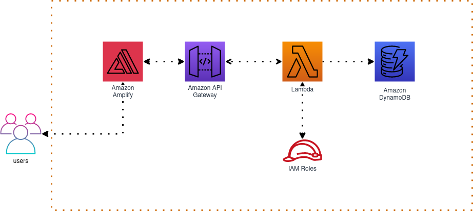

## About the Project

The project involved deploying a website on AWS Amplify and communicating with it through Amazon API Gateway. The website's backend functionality was implemented using AWS Lambda functions, which were properly configured with IAM roles to ensure secure access control. The results generated by the Lambda functions were stored in an Amazon DynamoDB database.

---
## Technologies
- 
- 
- 
- 
- 

---
## Workflow

1. **Setting up AWS Amplify:**
   - Create a new project in AWS Amplify.
   - Configure the development environment, including linking the code repository (e.g., GitHub).
   - Deploy the static web application to AWS Amplify.

2. **Configuring Amazon API Gateway:**
   - Create a new API in Amazon API Gateway.
   - Define API endpoints and configure integration with AWS Lambda.
   - Set up authorization and security policies as needed.

3. **Developing Lambda Functions:**
   - Write and test Lambda functions to provide backend logic for the web application.
   - Configure IAM roles for Lambda functions, ensuring they have necessary permissions to interact with other AWS services like DynamoDB.

4. **Setting up Amazon DynamoDB:**
   - Create a table in Amazon DynamoDB to store data generated by Lambda functions.
   - Define table structure and primary keys based on project requirements.

5. **Integrating Lambda with DynamoDB:**
   - Configure Lambda functions to read and write data to the DynamoDB table.
   - Implement necessary logic to process data received from the API and store results in DynamoDB.

